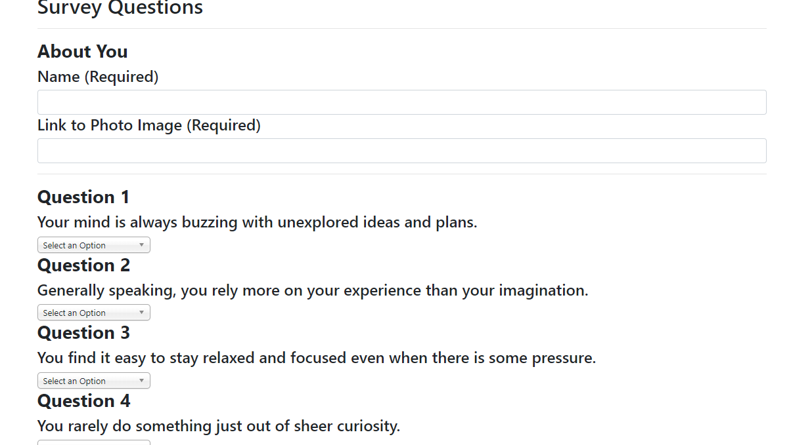

# Friend Finder

This match making application will help you find the long lost friend you didn't know you were missing. It has ten carefully selected statements, and for each one, you select on a scale of 1-5 how much you agree with it. It will then display the best match for you based on your responses. The app uses Express.js, Node.js, and RESTful API routes.

## [Try it out](https://still-bayou-68375.herokuapp.com/)



## Installing

To run the app locally, you will first need to git clone the repository to your local machine. 

HTTPS:
````
$ git clone https://github.com/leannr78/FriendFinder.git
````
SSH:
````
$ git clone git@github.com:leannr78/FriendFinder.git
````

Once cloned, cd into the repository and install the necessary dependencies by running:
````
$ npm install
````

You can then start the app locally by running: 
````
$ node server.js
````

## Built With

* [Express.js](https://expressjs.com/) - Node.js framework
* [jQuery](https://jquery.com/) - Front-end framework 
* [Node.js](https://nodejs.org/en/) - JavaScript runtime
* [npm](https://www.npmjs.com/) - Dependency management
* [Bootstrap](https://getbootstrap.com/) - CSS framework

## Authors
See contribution history [here](https://github.com/leannr78/FriendFinder/graphs/contributors)

## Future Updates
At the moment, the app will check your survey results against a seed file with results from various fake "friends." In the future, I would like to add in a database in order to have users match against one another instead of the seed file. 
